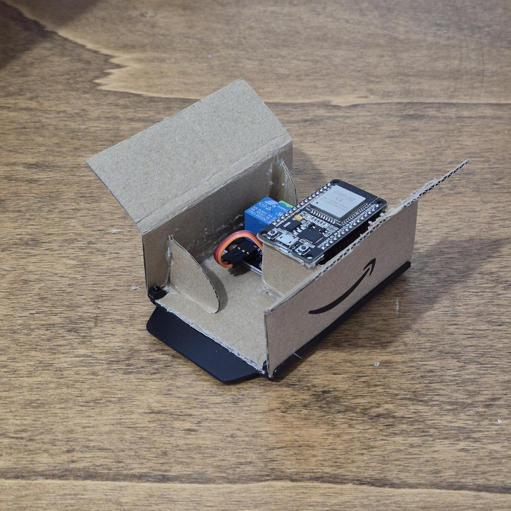

## Cos'è?
Host-Wirelessinator è un piccolo progetto che ho creato per permettermi di accendere il mio PC in remoto.

Questo progetto contiene il codice in C++ eseguito dal mio ESP32 collegato tramite relay ai pin del "POWER SWITCH" del PC, e il codice in HTML, CSS e TypeScript per potermi interfacciare con l'ESP32 dal browser.

## L'ESP32
La scheda è una ESP32-DevKit-V1 su cui ho collegato un relay per permettermi di chiudere il circuito del "POWER SWITCH" del mio PC in sicurezza.

|                                                                |                                                                |
| -------------------------------------------------------------- | -------------------------------------------------------------- |
|  |  |

Il codice dell'ESP32 è scritto per supportare la gestione (avvio) di più host, che essi siano collegati tramite relay o semplicemente sulla stessa rete e con il WakeOnLAN abilitato. Tutto è specificato all'interno di una stringa JSON simile a questa:

```json
{
    "number_of_hosts": 2,
    "0": {
        "name": "PC-NAME",
        "type": "Personal Computer",
        "control_options": {
            "use_relay": true,
            "relay_pin": 15,
            "use_magic_packet": false,
            "mac_address": ""
        }
    },
    "1": {
        "name": "Server-NAME",
        "type": "Server",
        "control_options": {
            "use_relay": false,
            "relay_pin": -1,
            "use_magic_packet": true,
            "mac_address": "00:00:00:00:00:00"
        }
    }
}
```

L'ESP32 rimane costantemente in ascolto di richieste sulla rete locale e alla ricezione del comando corretto effettua l'azione desiderata, di seguito la lista dei comandi che ho implementato:
- `GetHostsJson`: questo è il comando che l'interfaccia Web invia per primo in assoluto, permette all'interfaccia di ottenere una stringa JSON contenente gli host che è possibile comandare tramite l'ESP32, oltre ad altre informazioni sugli host stessi 
- `Boot <nome_host>`: questo comando, specificando il nome dell'host interessato, permette di accendere l'host tramite il relay o "magic packet" via rete in base a come specificato nella stringa JSON
